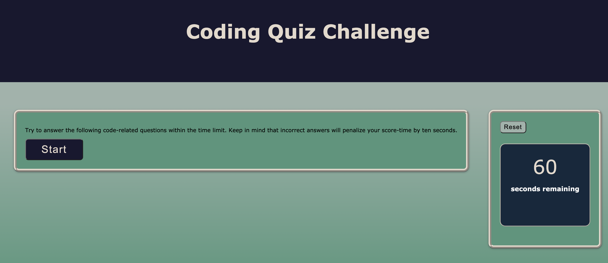
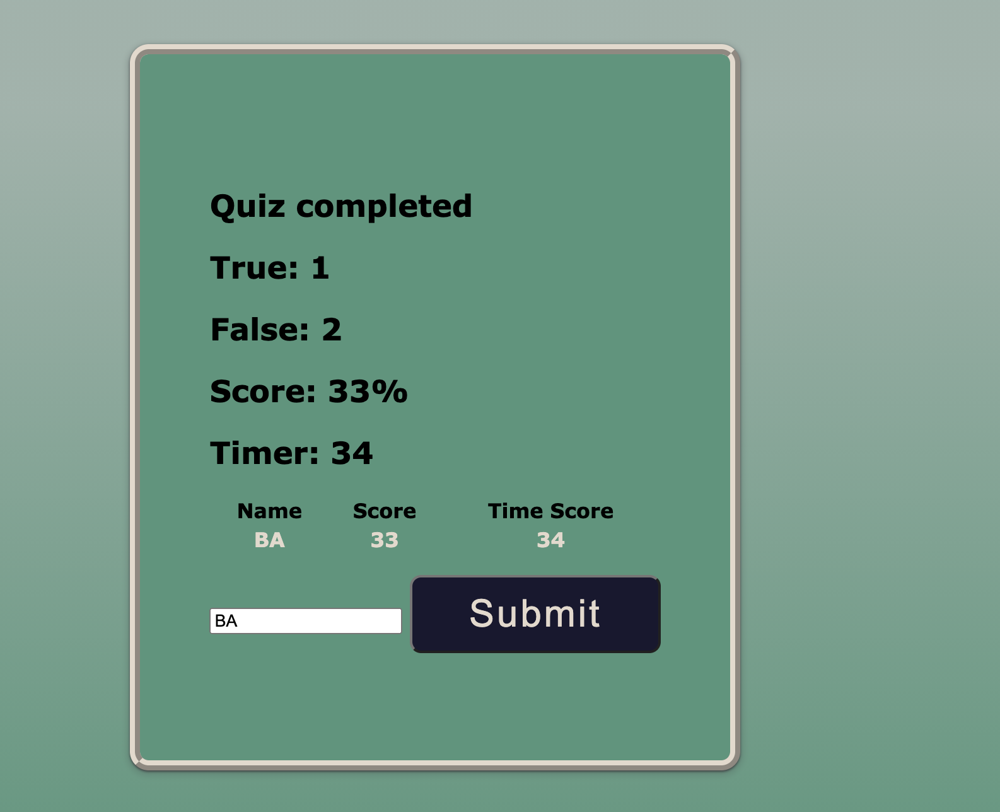
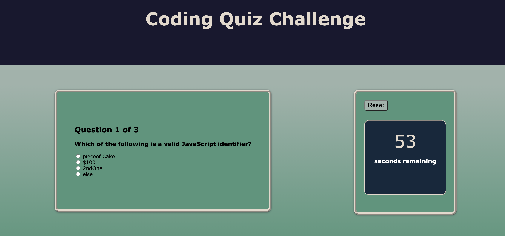

# coding-quiz

## Deployed Application: https://banuayozturk.github.io/coding-quiz/

## Description: 
Are you ready to take a quiz!

This is a code-quiz project. There is a start button that activates the question presentation one by one and starts the timer. Within the given time user answers questions. Incorrect answers substracts ten seconds as a a penalty. When all questions are answered or when the timer reaches zero, quiz ends. Then, user saves initials and gets the score.

This project has been a good practice to improve JavaScript DOM manipulation skills.

## Screenshot

## Credits/Libraries
 Stack Overflow

 Eloquent JavaScript Third Edition / Marijn Haverbeke

 [css.sitepoint.com - Question arrays and more...](https://www.sitepoint.com/simple-javascript-quiz/)

## Contact Me
For any question about the project, please contact me.
[BanuAyozturk](mailto:bnyksl@gmail.com)
